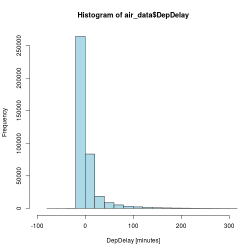
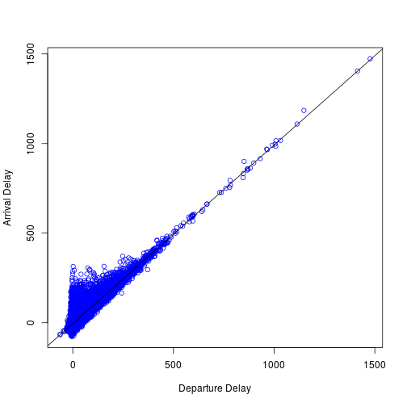

## Scope and References


- Airline on-time data are reported in 2014 to the U.S. Department of Transportation (DOT), Bureau of Transportation             Statistics (BTS) by the 14 U.S. air carriers that have at least 1 percent of total domestic scheduled-service passenger revenues. 

- The data cover nonstop scheduled-service flights between points within the United States (including territories). 

- Dataset are available since January 1995 up to now and include all departure and arrival statistics (scheduled departure time, actual departure time, scheduled elapse time, departure delay, wheels-off time and taxi-out time) by airport and airline; airborne time, cancellation and diversion by airport and airline.

- The airline on-time statistics data used for this assignment come originally from [RITA](http://www.transtats.bts.gov/OT_Delay/OT_DelayCause1.asp?pn=1).

- Due to the better compression in comparison to the original files, we downloaded the [september 2001](http://stat-computing.org/dataexpo/2009/2001.csv.bz2) data from there.

--- .class #id 

## Exploratory Data Analysis

- For the Shiny application, the analysis is restricted to data from September, 2001 and considers the variables `Month`, `DayofMonth`, `DepDelay` and `ArrDelay`.


```r
      air_data <- read.csv("../data//sep2001.csv", header = TRUE)
      head(air_data)
```

```
##         X Month DayofMonth ArrDelay DepDelay
## 1 4186032     9          5       22       31
## 2 4186033     9          6       14       19
## 3 4186034     9          7       43       54
## 4 4186035     9          8       14       15
## 5 4186036     9         10        0        4
## 6 4186037     9         11       NA       NA
```


--- .class #id 

## Delay Frequencies September 2001


```r
       hist(air_data$DepDelay, xlab="DepDelay [minutes]", col = "lightblue", xlim=c(-100,300), breaks=100)
```

 


--- .class #id 

## Results and Link to App

 

 
 - Test the Shiny application at http://jpielorz.shinyapps.io/DataProduct


